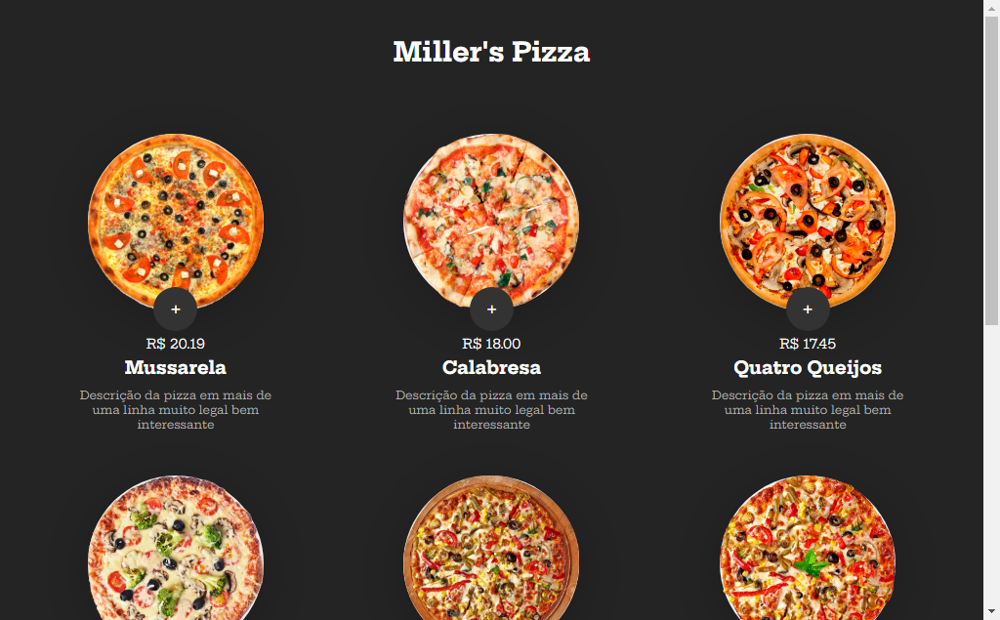

# Miller's Pizza

> Miller's

Esse foi um projeto de compras de pizza criado no curso de JavaScript da B7Web.

[Clique para acessar](https://guimiiller.github.io/pizza_b7/)

## 🚀 Tecnologias

- HTML
- CSS
- JavaScript
- Git e Github

## 💻 O que aprendi

- Como criar um carrinho com JS
- Aprendi uma nova função chamada CloneNode
- Aprendi a usar a função forEach
- Pegar as informações do JSON  

## 📨 Contato

- guilhermemillerblack@gmail.com